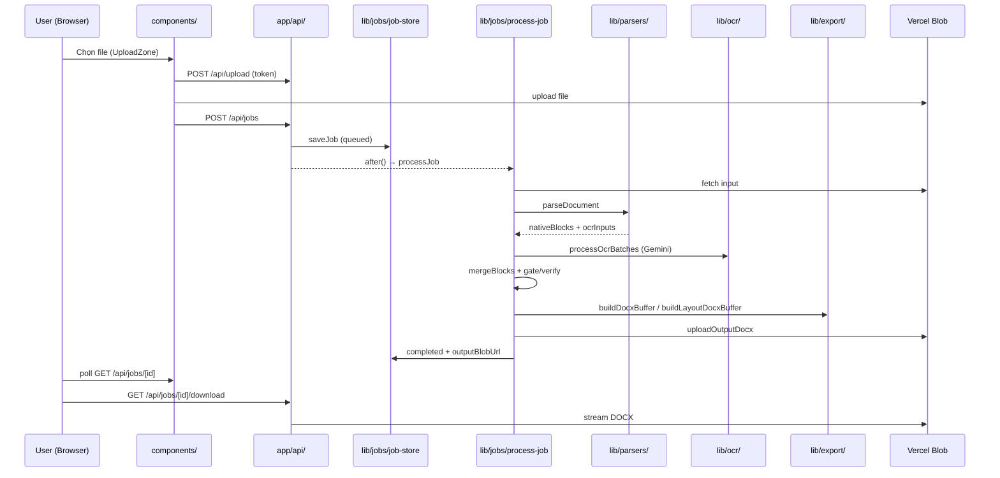

# OCR Web — Hướng dẫn đọc codebase theo luồng hoạt động

Tài liệu này giúp bạn **đọc lần lượt** từ lúc người dùng upload file đến khi tải DOCX, kèm vai trò từng folder/file. Đọc theo thứ tự mục **1 → 8** để nắm cơ chế end-to-end trước khi đi sâu chi tiết.

> **Stack:** Next.js 15 (App Router) · Vercel Blob · Vercel KV (prod) · Google Gemini · Vitest

---

## Sơ đồ luồng chính



---

## 1. Điểm bắt đầu — cấu hình & kiểu dữ liệu

Đọc trước khi vào UI/API để biết app cần gì và dữ liệu job trông như thế nào.

| File | Vai trò |
|------|---------|
| `package.json` | Scripts (`dev`, `build`, `test`), dependencies (`@google/generative-ai`, `@vercel/blob`, `docx`, `jszip`, `pdf-parse`, …) |
| `next.config.ts` | Cấu hình Next.js (Turbopack build) |
| `vercel.json` | `maxDuration: 300` cho route xử lý job trên Vercel |
| `vitest.config.ts` | Unit test — mirror cấu trúc `tests/lib/` ↔ `lib/` |
| `.env` / `.env.example` | Biến môi trường: `GEMINI_API_KEY`, `BLOB_READ_WRITE_TOKEN`, `LAYOUT_EXPORT_V2`, KV, … |
| **`lib/config.ts`** | **SSOT cấu hình:** parse env bằng Zod, model Gemini, batch size, retry backoff, ngưỡng layout v2 |
| **`lib/types.ts`** | **SSOT kiểu:** `Job`, `JobStatus`, `OcrBlock`, `OcrInput`, `ParseResult`, MIME hỗ trợ |
| `lib/errors.ts` | `JobProcessingError`, mã lỗi (`PAGE_LIMIT_EXCEEDED`, `OCR_FAILED`, …) |
| `lib/format-datetime.ts` | Format timestamp hiển thị UI |

**Luồng liên quan:** mọi API route và pipeline gọi `getConfig()` trước khi xử lý. Job có vòng đời: `queued` → `processing` → `completed` | `failed`.

---

## 2. Giao diện người dùng (đọc theo hành trình user)

### 2.1 Shell & trang chủ

| File | Vai trò |
|------|---------|
| `app/layout.tsx` | Layout HTML gốc, font, metadata |
| **`app/page.tsx`** | Trang chủ SSR: `listJobs(20)` + render `UploadZone` + `JobList` |
| `app/jobs/[id]/page.tsx` | Trang chi tiết job: `getJob(id)` → `JobDetailClient` |

### 2.2 Components (Client)

| File | Vai trò | Gọi API |
|------|---------|---------|
| **`components/upload-zone.tsx`** | Chọn file → validate MIME/size → upload Blob → tạo job → redirect `/jobs/[id]` | `POST /api/upload`, `POST /api/jobs` |
| **`components/job-list.tsx`** | Danh sách Recent jobs; checkbox chọn nhiều; bulk **Tải DOCX (ZIP)** / **Xóa** | `POST /api/jobs/bulk` |
| **`components/job-detail-client.tsx`** | Progress, lỗi, nút retry failed, download DOCX, preview blocks | `GET /api/jobs/[id]`, `POST /api/jobs/[id]/process` |
| `components/progress-bar.tsx` | Thanh % theo `job.progress.current/total` |
| `components/preview-panel.tsx` | Hiển thị danh sách block (heading/paragraph/table) — **preview v1**, không phải layout Word |

### 2.3 Hook polling

| File | Vai trò |
|------|---------|
| **`hooks/use-job-poll.ts`** | Tự poll `GET /api/jobs/[id]` khi job active; backoff 2s→5s→10s; dừng sau 10 phút; pause khi tab ẩn |

**Luồng user typcial:**
1. `/` → upload file
2. `/jobs/[id]` → xem progress (poll)
3. `completed` → Download DOCX hoặc quay `/` xem Recent jobs

---

## 3. Lớp API (Next.js Route Handlers)

Mỗi route mỏng: validate input → gọi `lib/` → trả JSON hoặc file.

| Route | File | Chức năng |
|-------|------|-----------|
| Upload token | `app/api/upload/route.ts` | `handleUpload` Vercel Blob — giới hạn MIME/size, trả token cho client upload |
| Tạo & liệt kê job | **`app/api/jobs/route.ts`** | `GET` list 20 job; `POST` tạo job + `after(runJobProcessing)` |
| Chi tiết job | `app/api/jobs/[id]/route.ts` | `GET` một job (poll dùng endpoint này) |
| Trigger/retry OCR | `app/api/jobs/[id]/process/route.ts` | `POST` chạy lại pipeline (failed → queued) |
| Download 1 file | `app/api/jobs/[id]/download/route.ts` | Stream DOCX từ `outputBlobUrl` |
| Bulk delete/download | `app/api/jobs/bulk/route.ts` | `POST { ids, action }` — xóa nhiều job hoặc ZIP nhiều DOCX |

**Validation chung:**

| File | Vai trò |
|------|---------|
| `lib/api/schemas.ts` | Zod: `createJobBodySchema`, `jobIdParamSchema`, `bulkJobActionSchema` |
| `lib/api/parse-request.ts` | `parseJsonBody`, `parseParams`, trả 400 khi validation fail |

**Luồng tạo job (`POST /api/jobs`):**
```
validate body → uuid job → saveJob(queued) → after(processJob) → 201 { job }
```

---

## 4. Lưu trữ job & Blob

### 4.1 Job store

| File | Vai trò |
|------|---------|
| **`lib/jobs/job-store.ts`** | CRUD job: Vercel KV (prod) hoặc `.tmp/ocr-jobs/*.json` (local dev) |
| `lib/jobs/job-slim.ts` | Cắt metadata job trước khi ghi KV (giới hạn ~50 block preview) |
| `lib/jobs/trigger-processing.ts` | Wrapper `runJobProcessing` → `processJob`; flag `USE_INNGEST` (chưa wired) |
| `lib/jobs/poll-interval.ts` | Hằng số backoff poll (dùng bởi hook + tests) |
| `lib/jobs/bulk-download.ts` | Gom nhiều DOCX completed thành ZIP (`jszip`) |

**Hàm quan trọng trong `job-store.ts`:**
- `saveJob` / `getJob` / `listJobs` / `updateJob`
- `tryClaimJobProcessing` — chỉ một worker được `queued` → `processing`
- `deleteJob` — xóa KV hoặc file dev

### 4.2 Blob helpers

| File | Vai trò |
|------|---------|
| `lib/blob-constants.ts` | `BLOB_ACCESS` (private) |
| `lib/blob-pathname.ts` | Sinh pathname upload an toàn |
| **`lib/blob.ts`** | `fetchBlobBuffer`, `uploadOutputDocx`, `buildDocxDownloadPath`, header Content-Disposition UTF-8 |

**Luồng dữ liệu file:**
```
Input:  user upload → blobUrl (input)
Output: processJob → uploadOutputDocx → outputBlobUrl
Download: API route đọc outputBlobUrl → stream về browser
```

---

## 5. Parse — từ file nhị phân sang block + ảnh OCR

Entry point: **`lib/parsers/index.ts`** → `parseDocument(buffer, mimeType, fileName)`.

| File | Vai trò |
|------|---------|
| **`lib/parsers/pdf-parser.ts`** | PDF: đếm trang; v1 dùng text layer nếu đủ dài; **v2 (`LAYOUT_EXPORT_V2`) luôn render PNG từng trang** |
| `lib/parsers/pdf-render.ts` | Render trang PDF → PNG buffer (input cho Gemini layout) |
| `lib/parsers/docx-parser.ts` | Trích paragraph/table từ DOCX + OCR ảnh nhúng |
| `lib/parsers/image-parser.ts` | Ảnh JPG/PNG/WebP → 1 trang `OcrInput` |
| `lib/parsers/image-constants.ts` | Hằng số MIME ảnh |

**Output `ParseResult`:**
- `pageCount` — kiểm tra `MAX_PAGES`
- `nativeBlocks` — text có sẵn (PDF text layer, DOCX, …)
- `ocrInputs` — mảng `{ page, imageBase64, mimeType }` cần gửi Gemini

**Điểm then chốt MISA/hóa đơn:** PDF có text layer nhưng **không có layout bảng**. V2 bỏ shortcut text layer, bắt buộc OCR layout từ ảnh.

---

## 6. OCR — Gemini batch & layout v2

Entry: **`lib/jobs/process-job.ts`** gọi `processOcrBatches(parsed.ocrInputs, onProgress)`.

### 6.1 Batch orchestration

| File | Vai trò |
|------|---------|
| **`lib/ocr/batch-processor.ts`** | Chia `ocrInputs` thành batch; pool concurrency; gọi `ocrInputs` (v1) hoặc `ocrLayoutInputs` (v2) |
| **`lib/ocr/gemini-client.ts`** | Client Google Generative AI; retry + **model fallback** khi 503; JSON mode layout |
| **`lib/ocr/prompts.ts`** | System/user prompt OCR v1, layout v2, structure, verify; prompt đặc thù hóa đơn VAT |
| `lib/ocr/layout-normalize.ts` | Parse JSON Gemini → `OcrBlock[]`; gán `region` từ bbox; sort `(page, y, x)` |
| `lib/ocr/structure-pass.ts` | v1: gọi Pro refine bảng/phức tạp sau OCR Flash |
| `lib/ocr/completeness-gate.ts` | v2: kiểm tra bảng ≥4 cột, ô số, SL×đơn giá≈thành tiền (VN number) |
| `lib/ocr/parse-vn-number.ts` | Parse số kiểu Việt (`526.433,42`, `1.000.000`) |
| `lib/ocr/verify-pass.ts` | v2: crop vùng lỗi → OCR lại bằng Pro → merge; tối đa `MAX_LAYOUT_VERIFY_RETRIES` |

**Luồng OCR v1 (`LAYOUT_EXPORT_V2=false`):**
```
ocrInputs (Flash) → mergeBlocks → maybeStructurePass (Pro) → buildDocxBuffer
```

**Luồng OCR v2 (`LAYOUT_EXPORT_V2=true`):**
```
ocrLayoutInputs (Flash + bbox)
  → mergeBlocks (layoutMode=true)
  → runCompletenessGate
  → (fail) runLayoutVerifyPass
  → runCompletenessGate lần 2
  → buildLayoutDocxBuffer
```

---

## 7. Merge & xuất DOCX

| File | Vai trò |
|------|---------|
| **`lib/merge-blocks.ts`** | Gộp `nativeBlocks` + OCR blocks; v2 gán bbox synthetic cho native; sort theo layout |
| **`lib/export/docx-builder.ts`** | v1: DOCX tuần tự (heading, paragraph, table) |
| **`lib/export/layout-docx-builder.ts`** | v2: 3 band trái/giữa/phải + bảng full-width; giữ số & ký tự đặc biệt |

**Orchestrator pipeline — đọc file này để hiểu toàn bộ server-side:**

```
lib/jobs/process-job.ts
```

Thứ tự trong `processJob`:
1. `tryClaimJobProcessing`
2. `fetchBlobBuffer` → `parseDocument`
3. Kiểm tra `MAX_PAGES`
4. `processOcrBatches` + cập nhật progress
5. `mergeBlocks`
6. v2: gate + verify **hoặc** v1: `maybeStructurePass`
7. `buildLayoutDocxBuffer` / `buildDocxBuffer`
8. `uploadOutputDocx` → `updateJob(completed)` hoặc `failed`

---

## 8. Tests & fixture (đọc sau khi hiểu luồng)

| Thư mục | Vai trò |
|---------|---------|
| `tests/lib/api/` | Schema validation |
| `tests/lib/jobs/` | job-store, poll, process-job layout, bulk-download |
| `tests/lib/ocr/` | gate, normalize, prompts, gemini mock, verify |
| `tests/lib/parsers/` | PDF parser (text layer vs layout mode) |
| `tests/lib/export/` | DOCX builders |
| `tests/fixtures/` | Ảnh/PDF mẫu (golden VAT invoice) |

Chạy: `npm test` · `npm run build`

---

## Bảng tra nhanh: “Tôi muốn sửa X thì mở file nào?”

| Mục tiêu | File chính |
|----------|------------|
| UI upload / giới hạn file client | `components/upload-zone.tsx` |
| Danh sách job + bulk action | `components/job-list.tsx`, `app/api/jobs/bulk/route.ts` |
| Poll / refresh trang job | `hooks/use-job-poll.ts`, `lib/jobs/poll-interval.ts` |
| Tạo job / chạy nền | `app/api/jobs/route.ts`, `lib/jobs/trigger-processing.ts` |
| Toàn bộ pipeline OCR | **`lib/jobs/process-job.ts`** |
| PDF MISA / layout scan | `lib/parsers/pdf-parser.ts`, `lib/parsers/pdf-render.ts` |
| Prompt Gemini / hóa đơn VAT | `lib/ocr/prompts.ts` |
| Kiểm tra bảng số liệu | `lib/ocr/completeness-gate.ts`, `lib/ocr/parse-vn-number.ts` |
| Retry vùng lỗi | `lib/ocr/verify-pass.ts` |
| DOCX 3 cột | `lib/export/layout-docx-builder.ts` |
| Model / env / retry 503 | `lib/config.ts`, `lib/ocr/gemini-client.ts` |
| Lưu job prod vs local | `lib/jobs/job-store.ts` |
| Download tên file tiếng Việt | `lib/blob.ts` |

---

## Thứ tự đọc đề xuất (checklist)

- [ ] **1** — `lib/types.ts`, `lib/config.ts`
- [ ] **2** — `components/upload-zone.tsx` → `app/api/upload/route.ts` → `app/api/jobs/route.ts`
- [ ] **3** — `lib/jobs/job-store.ts`, `lib/blob.ts`
- [ ] **4** — `lib/jobs/process-job.ts` (đọc một lần overview)
- [ ] **5** — `lib/parsers/index.ts` → `pdf-parser.ts` (v2 branch)
- [ ] **6** — `lib/ocr/batch-processor.ts` → `gemini-client.ts` → `prompts.ts`
- [ ] **7** — `lib/merge-blocks.ts` → `completeness-gate.ts` → `verify-pass.ts`
- [ ] **8** — `lib/export/layout-docx-builder.ts` (hoặc `docx-builder.ts` nếu v1)
- [ ] **9** — `components/job-detail-client.tsx`, `hooks/use-job-poll.ts`
- [ ] **10** — `components/job-list.tsx`, `app/api/jobs/bulk/route.ts`

Sau checklist trên, bạn đã đi đủ một vòng **upload → OCR → DOCX → poll → download/delete**.

---

## Liên kết

- Hướng dẫn cài đặt & env: [`README.md`](../README.md)
- OpenSpec change layout v2: `openspec/changes/ocr-web-v2-layout-output/` (ở workspace gốc SBU2-AI-Kit)
